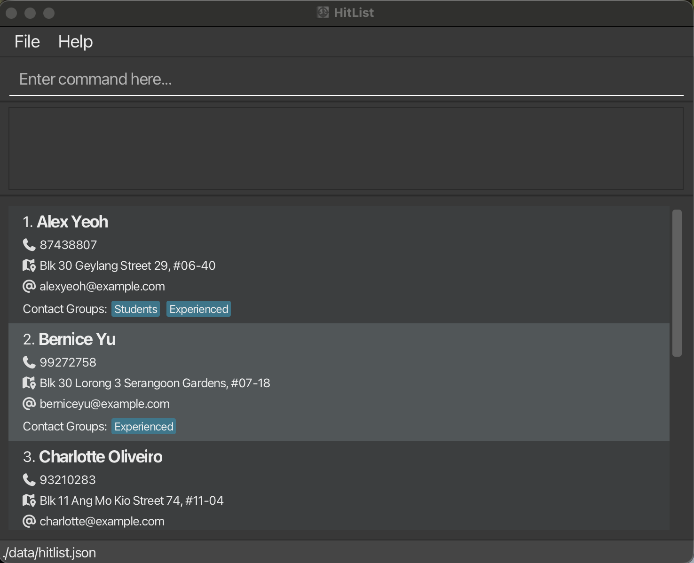

[](https://github.com/AY2526S2-CS2103T-W11-2/tp/actions)
[](https://codecov.io/gh/AY2526S2-CS2103T-W11-2/tp)

# HitList



# About

HitList helps headhunters and recruiters to alleivate the logistics of matching candidates to clients.

# Installation
This project uses Java 17. Ensure that your system is setup with a Java 17 JDK.

You can clone this project using the `git clone` command on the command line:
```
git clone https://github.com/AY2526S2-CS2103T-W11-2/tp.git
cd tp
```

To build the application run:
```
gradlew build
```

# Usage
To run the application from the command line, run:
```
gradlew run
```

For the detailed documentation of this project, see the **[HitList Product Website](https://ay2526s2-cs2103t-w11-2.github.io/tp/)**.

# Acknowledgements

This project is based on the AddressBook-Level3 project created by the [SE-EDU initiative](https://se-education.org).
