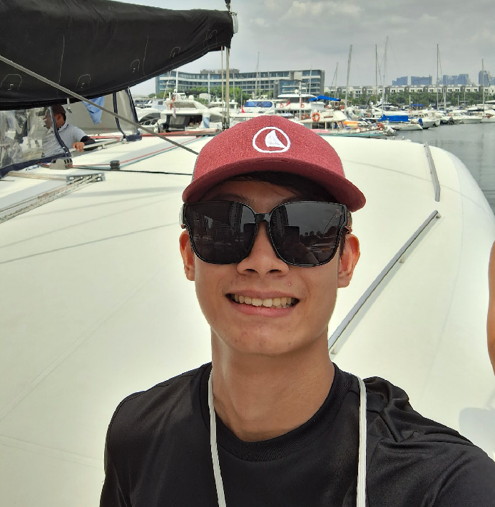
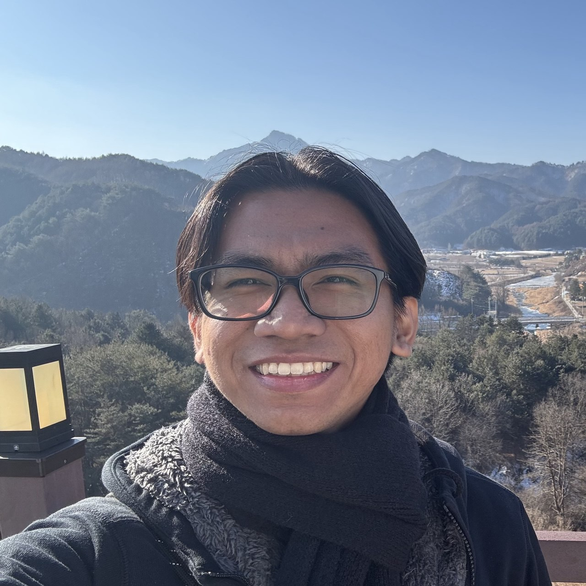
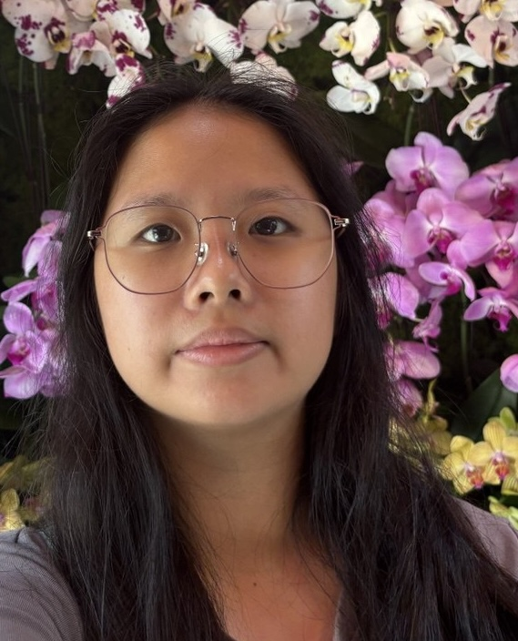
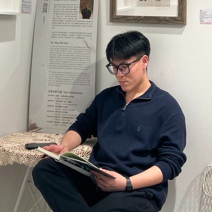

# About Us

We are a team based in the [School of Computing, National University of Singapore](http://www.comp.nus.edu.sg).

You can reach us at the email `seer[at]comp.nus.edu.sg`

## Project team

### Luke Tan Zhi Yong

[[github](https://github.com/lukeetann)]

* Role: Developer

### Eugenio Manansala

[[github](http://github.com/Egg-Fish)]

* Role: Developer

### Ngui Jia Le Sherlena

[[homepage](sherlena.c4rr0ting.com)]
[[github](https://github.com/C4RR0T02)]

* Role: Developer
* Responsibilities: Data

### Nicholas Ling

[[github](http://github.com/niclzy)]

* Role: Developer
* Responsibilities: Dev Ops + Threading

### Zuriel Shanley Tanyory

[[github](http://github.com/leiruz)]

* Role: Developer
* Responsibilities: Data
