# HitList User Guide

HitList is a **desktop app for managing contacts, optimized for use via a Command Line Interface** (CLI) while still having the benefits of a Graphical User Interface (GUI). If you can type fast, HitList can get your contact management tasks done faster than traditional GUI apps.

HitList is targeted towards recruiters and headhunters who are fast typist and need to manage a large number of contacts and companies.

--------------------------------------------------------------------------------------------------------------------

## Table of Contents

* [HitList User Guide](#hitlist-user-guide)
    * [Quick start](#quick-start)
    * [Features](#features)
        * [Getting help : `help`](#getting-help-help)
        * [Adding a contact : `add`](#adding-a-contact-add)
        * [Editing a contact : `edit`](#editing-a-contact-edit)
        * [Deleting a contact : `delete`](#deleting-a-contact-delete)
        * [Listing all contacts : `list`](#listing-all-contacts-list)
        * [Locating contacts : `find`](#locating-contacts-find)
        * [Adding a contact group : `grpadd`](#adding-a-contact-group-grpadd)
        * [Deleting a contact group : `grpdel`](#deleting-a-contact-group-grpdel)
        * [Listing contacts in a contact group : `grplist`](#listing-contacts-in-a-contact-group-grplist)
        * [Assigning a contact to a contact group : `grpassign`](#assigning-a-contact-to-a-contact-group-grpassign)
        * [Unassigning a contact from a contact group : `grpunassign`](#unassigning-a-contact-from-a-contact-group-grpunassign)
        * [Adding a company : `cmpadd`](#adding-a-company-cmpadd)
        * [Deleting a company : `cmpdel`](#deleting-a-company-cmpdel)
        * [Listing all Companies : `cmplist`](#listing-all-companies-cmplist)
        * [Locating companies : `cmpfind`](#locating-companies-cmpfind)
        * [Adding a role to a company : `roleadd`](#adding-a-role-to-a-company-roleadd)
        * [Deleting a role from a company : `roledel`](#deleting-a-role-from-a-company-roledel)
        * [Clearing all entries : `clear`](#clearing-all-entries-clear)
        * [Exiting the program : `exit`](#exiting-the-program-exit)
        * [Saving the data](#saving-the-data)
        * [Editing the data file](#editing-the-data-file)
        * [Archiving data files `[coming in v2.0]`](#archiving-data-files-coming-in-v2-0)
    * [Glossary](#glossary)
    * [FAQ](#faq)
    * [Command summary](#command-summary)

--------------------------------------------------------------------------------------------------------------------

## Quick start

1. Ensure you have Java `17` or above installed in your Computer.
2. **Mac users:** Ensure you have the precise JDK version prescribed [here](https://se-education.org/guides/tutorials/javaInstallationMac.html).
3. Download the latest `.jar` file from [here](https://github.com/AY2526S2-CS2103T-W11-2/tp/releases).
4. Copy the file to the folder you want to use as the _home folder_ for your HitList.
5. Open a command terminal, `cd` into the folder you put the jar file in, and use the `java -jar hitlist.jar` command to run the application.
6. A GUI similar to the below should appear in a few seconds. Note how the app contains some sample data.

  

    <pic src="images/ug/Ui.png" alt="Ui"></pic>
  

 

7. Type the command in the command box and press Enter to execute it.
   e.g. typing `help` and pressing Enter will open the help window.
8. Some example commands you can try:
    * `add /n John Doe /p 98765432` : Adds a contact named `John Doe` to the HitList.
    * `list` : Lists all contacts.
    * `delete 3` : Deletes the 3rd contact shown in the current list.
    * `clear` : Deletes all contacts.
    * `exit` : Exits the app.
9. Refer to the [Features](#features) below for details of each command.

--------------------------------------------------------------------------------------------------------------------

## Features

**Notes about the command format:**

* Words in `UPPER_CASE` are the parameters to be supplied by the user.
  e.g. in `add /n NAME`, `NAME` is a parameter which can be used as `add /n John Doe`
* Items in square brackets are optional.
  e.g. `edit INDEX [/n NAME] [/p PHONE_NUMBER]` can be used as `edit 3 /n John Doe` or as `edit 3 /p 98765432`
* Parameters can be in any order.
  e.g. if the command specifies `/n NAME /p PHONE_NUMBER`, `/p PHONE_NUMBER /n NAME` is also acceptable
* Extraneous parameters for commands that do not take in parameters, such as `help`, `list`, `exit`, and `clear`, will be ignored.
  e.g. if the command specifies `help 123`, it will be interpreted as `help`
* If you are using a PDF version of this document, be careful when copying and pasting commands that span multiple lines as space characters surrounding line-breaks may be omitted when copied over to the application.

### Getting help : `help`

Shows a message explaining how to access the help page.

Format: `help`

  

    
  

 

### Adding a contact : `add`

Adds a contact to the HitList.

Format: `add /n NAME /p PHONE_NUMBER [/e EMAIL] [/a ADDRESS]`

* The `NAME` and `PHONE_NUMBER` parameters are mandatory.
* `NAME` must be unique and not the same as any existing contact in HitList.
* `PHONE_NUMBER` must be unique and not the same as any existing contact in HitList.
* All other parameters are optional.

Limitations:
* `NAME` can only contain alphabetic characters, dashes, apostrophes, and spaces (No support for chinese characters and names with '/').
* `PHONE_NUMBER` must only contain digits, and must not be blank.
* `EMAIL` must be in the format `local-part@domain`, where `local-part` and `domain` are non-empty strings that do not contain spaces or `/`.
* `EMAIL` does not implement uniqueness check, so multiple contacts can have the same email.
* `ADDRESS` must not contain `/` and must not be blank.

Examples:
* `add /n John Doe /p 98765432`

  

    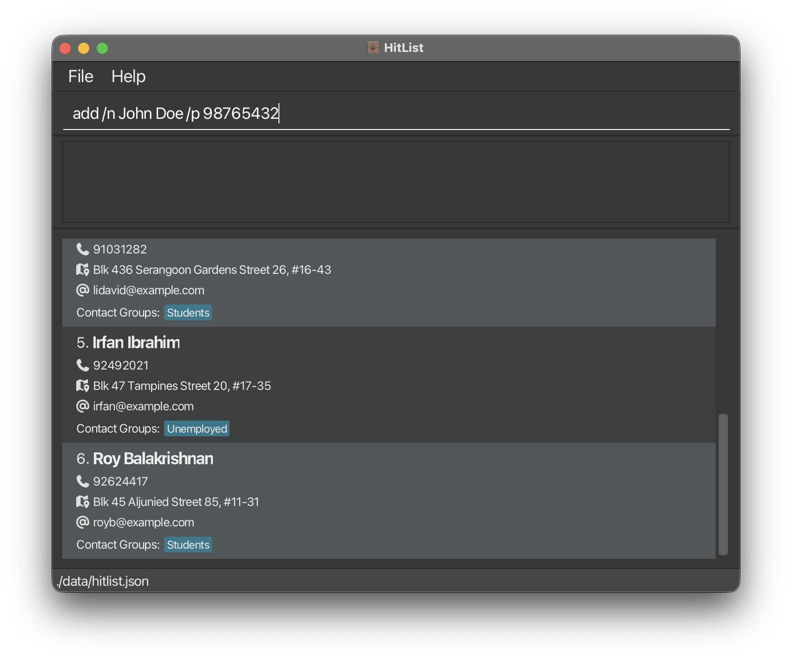
  

  

    
  

 

* `add /n Betsy Crowe /p 87654321 /e betsy.crowe@gmail.com /a 321, Clementi Rd, 123465`

  

    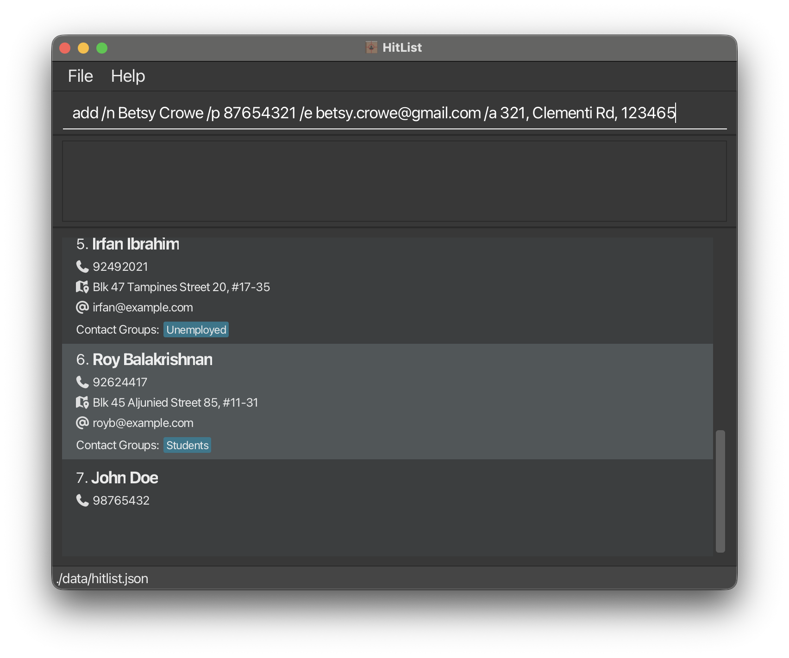
  

  

    
  

 

### Editing a contact : `edit`

Edits an existing contact in the HitList.

Format: `edit INDEX [/n NAME] [/p PHONE_NUMBER] [/e EMAIL] [/a ADDRESS]`

* Edits the contact at the specified `INDEX`.
* The index refers to the index number shown in the displayed HitList.
* The index **must be a positive integer** `1, 2, 3, …`
* At least one of the optional fields must be provided.
* Existing values will be updated to the input values.

Examples:

* `edit 1 /p 91234567` edits the phone number of the first contact to `91234567`

  

    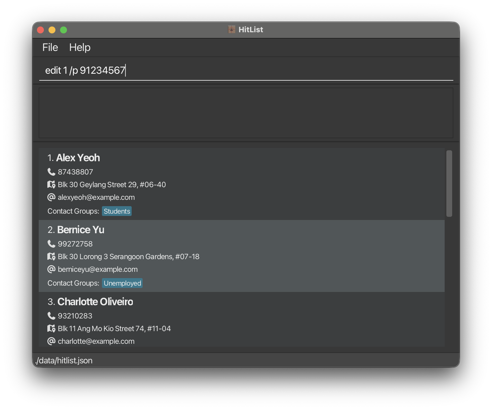
  

  

    
  

 

* `edit 2 /n Betsy Crower` edits the name of the second contact to `Betsy Crower`

  

    
  

  

    
  

 

### Deleting a contact : `delete`

Deletes the specified contact from HitList.

<box theme="danger" header="**CAUTION: Irreversible Action**">
    This command deletes the selected contact in HitList. Use with caution.
    The action is <b>irreversible</b> and there is <b>no confirmation prompt</b> before the action is executed.
</box>

Format: `delete INDEX` or `delete /n NAME` or `del INDEX` or `del /n NAME`

* Deletes the contact at the specified `INDEX` or the contact with the specified `NAME` from HitList.
* The index refers to the index number shown in the displayed HitList.
* The index **must be a positive integer** `1, 2, 3, …`
* The contact name you enter must exactly match an existing contact in HitList, but it is case-insensitive. For example, if the contact is saved as 'Alfred Lim', entering 'alfred lim', 'ALFRED LIM', or 'Alfred Lim' will all successfully match.
* Either the index or the name can be used to delete a contact, but not both at the same time.

Examples:
* `list` followed by `delete 2` deletes the second contact in HitList

  

    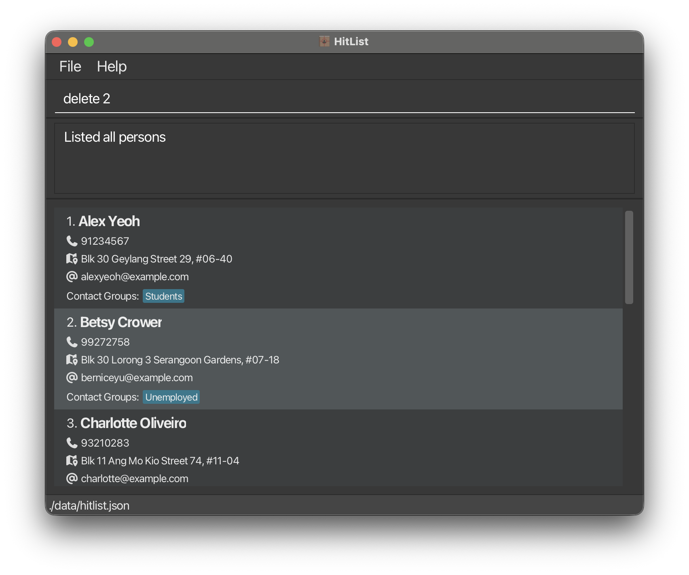
  

  

    
  

 

* `find irfan` followed by `delete 1` deletes the first contact in the results of the `find` command

  

    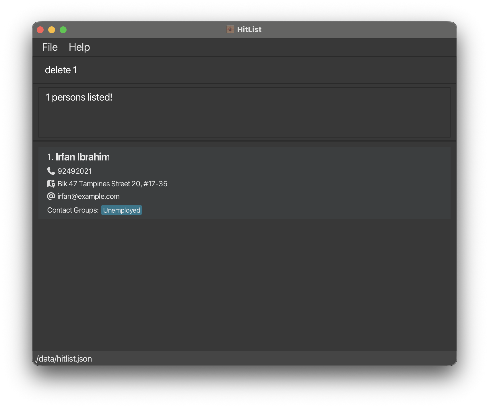
  

  

    
  

 

* `list` followed by `delete /n David Li` deletes the contact named `David Li` from HitList

  

    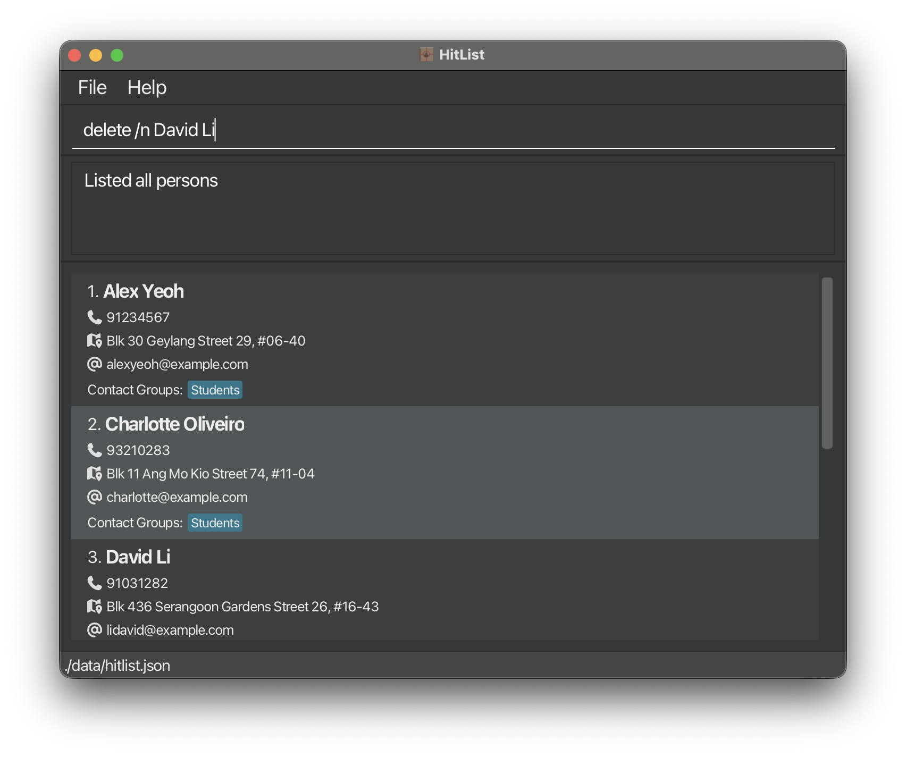
  

  

    
  

 

### Listing all contacts : `list`

Shows a list of all contacts in the HitList.

Format: `list`

  

    
  

 

### Locating contacts : `find`

Finds contacts whose names match the given substring.

Format: `find KEYWORD...`

* Name search is case-insensitive.
  e.g. `HANS` matches `Hans`
* Name search uses substring matching.
  e.g. `Ha` matches `Hans`
  e.g. `an` matches `Hans`
* If multiple name keywords are given, a contact matching any one of them is returned.

Examples:
* `find John` returns `john` and `John Doe`

  

    
  

 

* `find alex krishnan` returns `Alex Yeoh`, `Roy Balakrishnan`

  

    
  

 

### Adding a contact group : `grpadd`

Adds a contact group to the HitList. Optionally, existing contacts can be added to the group at the time of group creation.

Format: `grpadd /g GROUP_NAME [/n NAME]...`

Examples:
* `grplist` followed by `grpadd /g Experienced`

  

    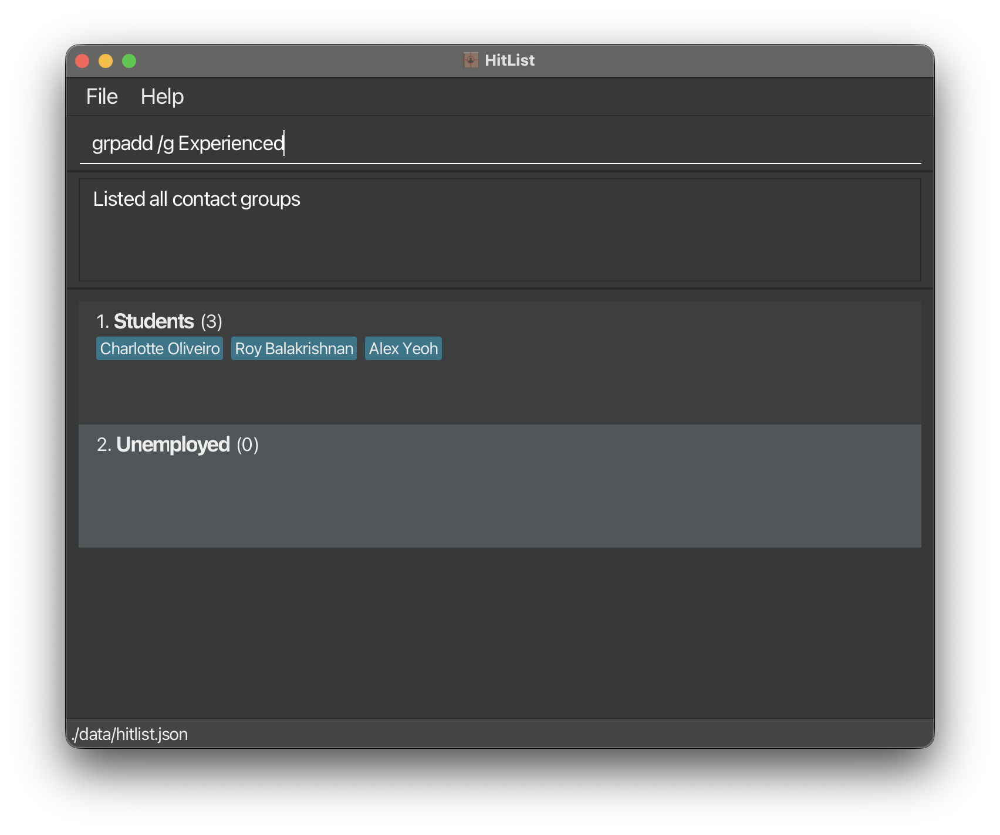
  

  

    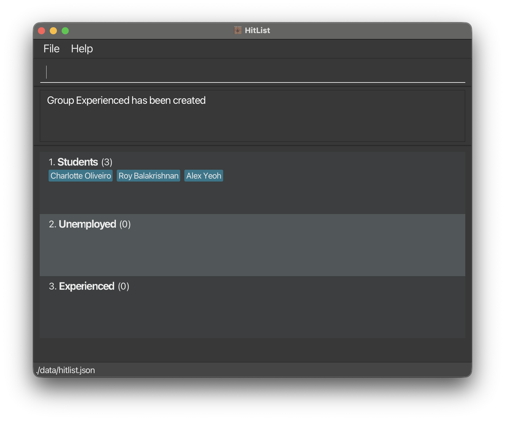
  

 

* `grplist` followed by `grpadd /g Admins /n Betsy Crowe`

  

    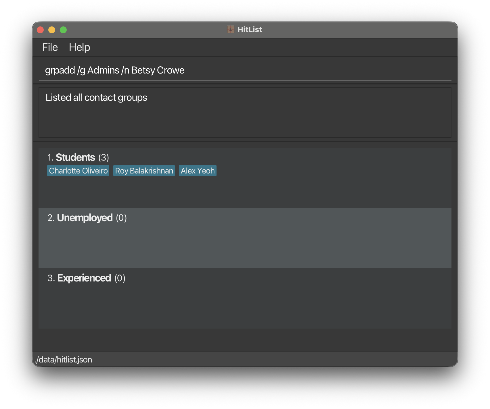
  

  

    
  

 

### Deleting a contact group : `grpdel`

Deletes the specified contact group from HitList.

<box theme="danger" header="**CAUTION: Irreversible Action**">
    This command <b>instantly deletes</b> the selected contact group. There is <b>no confirmation prompt</b>.
</box>

<box theme="info" header="**INFO: Good to know**">
    This <b>only</b> deletes the <b>group</b> itself and the <b>association of contacts to that group</b>. The actual contacts (e.g., John Doe) remain safe in your HitList database.
</box>

Format: `grpdel /g GROUP_NAME`

Examples:
* `grplist` followed by `grpdel /g Admins`

  

    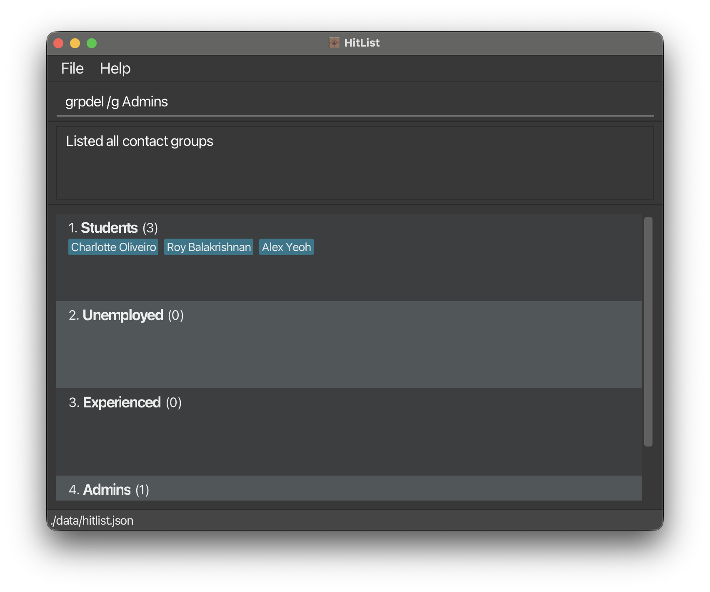
  

  

    
  

 

### Listing contacts in a contact group : `grplist`

List all contact groups in HitList. Optionally, if a group name is specified, shows a list of contact members in that group.

Format: `grplist [/g GROUP_NAME]`

Examples:

* `grplist`

  

    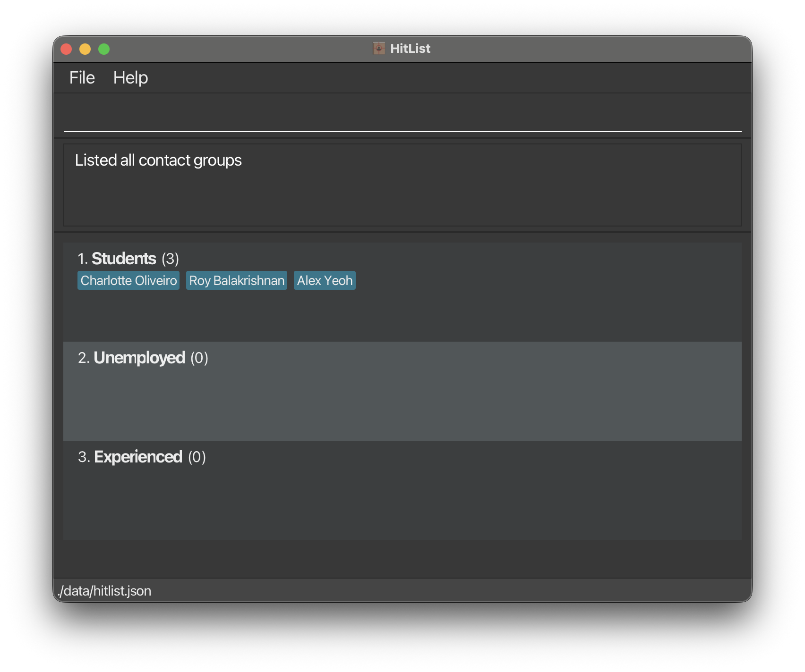
  

 

* `grplist /g Students`

  

    
  

 

### Assigning a contact to a contact group : `grpassign`

Adds an existing contact to an existing contact group.

Format: `grpassign /n NAME /g GROUP_NAME`

* The contact name must exactly match an existing contact in HitList.
* The group name must exactly match an existing contact group in HitList.

Examples:
* `grplist /g experienced` followed by `grpassign /n Alex Yeoh /g Experienced`

  

    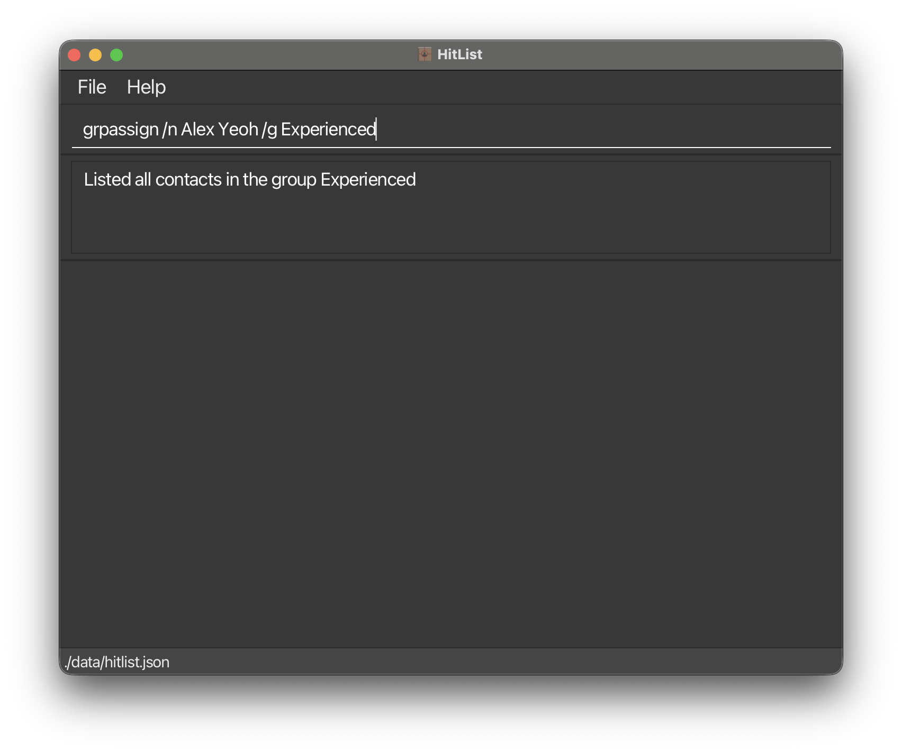
  

  

    
  

 

### Unassigning a contact from a contact group : `grpunassign`

Removes an existing contact from an existing contact group.

Format: `grpunassign /n NAME /g GROUP_NAME`

* The contact name must exactly match an existing contact in HitList.
* The group name must exactly match an existing contact group in HitList.
* The contact must already belong to the specified group.

Examples:

* `grplist /g experienced` followed by `grpunassign /n Alex Yeoh /g Experienced`

  

    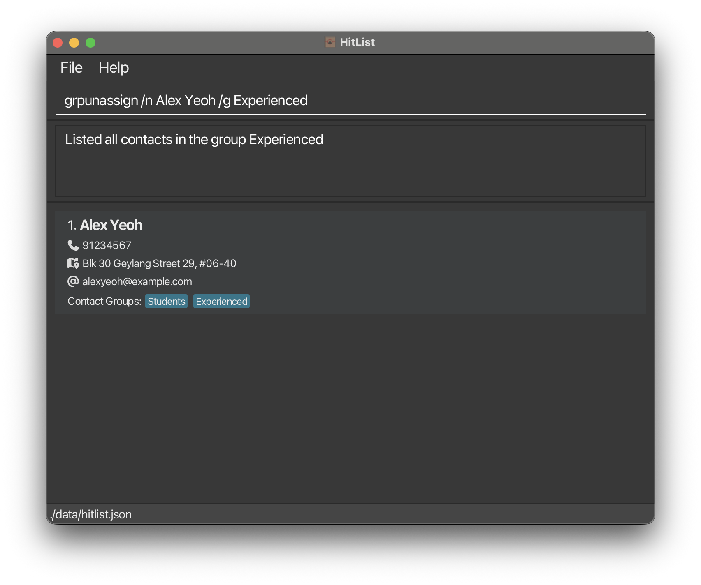
  

  

    
  

 

### Adding a company : `cmpadd`

Adds a company to the HitList.

Format: `cmpadd /c COMPANY_NAME /d COMPANY_DESCRIPTION`

* The company name must be unique and not the same as any existing company in HitList.
* The company name can be any string which does not include `/` or invisible characters.
* The company description can be any string which does not include `/` or invisible characters.

Limitations:
* Company name is restricted to a maximum of 30 characters.
* Company description is restricted to a maximum of 100 characters.
* No full support for languages other than English.

Examples:

* `cmplist` followed by `cmpadd /c Bata /d Shoe company`

  

    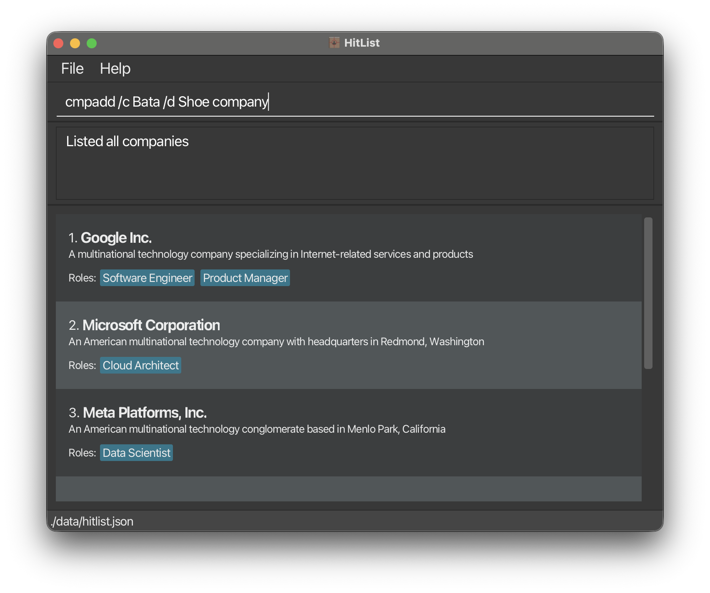
  

  

    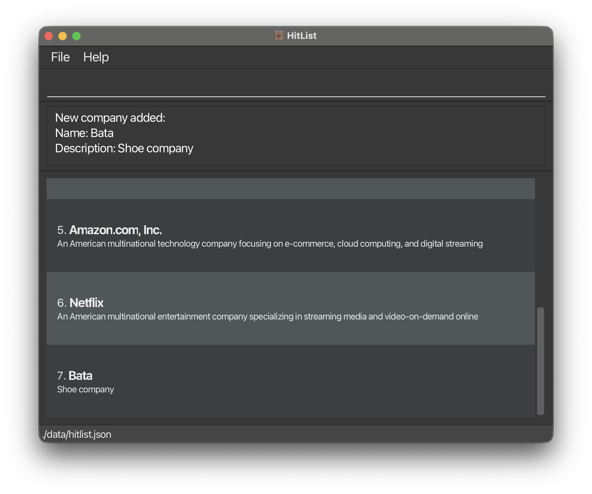
  

 

### Deleting a company : `cmpdel`

Deletes the specified company from HitList.

<box theme="danger" header="**CAUTION: Cascading Deletion**">
    This command instantly deletes the specified company. <b>There is no confirmation prompt.</b>
    Please note that <b>all roles associated with this company will also be permanently deleted</b> from HitList. Use with extreme caution.
</box>

Format: `cmpdel /c COMPANY_NAME`

* The company name must be an existing company in HitList.
* The company name search is **case-insensitive** (e.g., `google` matches `Google`/`GoOgLe`/`GOOGLE`).
* The search matches the **exact company name** as stored in HitList. For example, `cmpfind google` will match a company named exactly `Google`, but will **not** match `Google Inc.` or `google.com` since those are different company names.
* The company will be displayed with its original registered name (e.g., `Google`) after the operation.

Example:

* `cmplist` followed by `cmpdel /c Bata`

  

    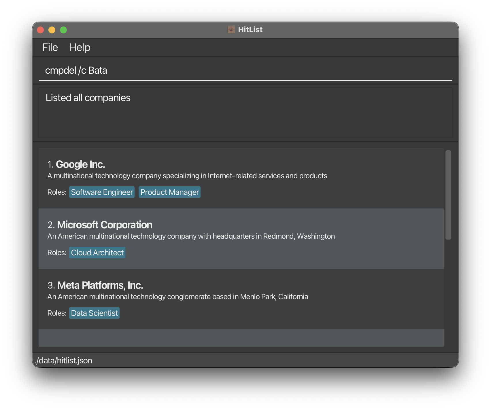
  

  

    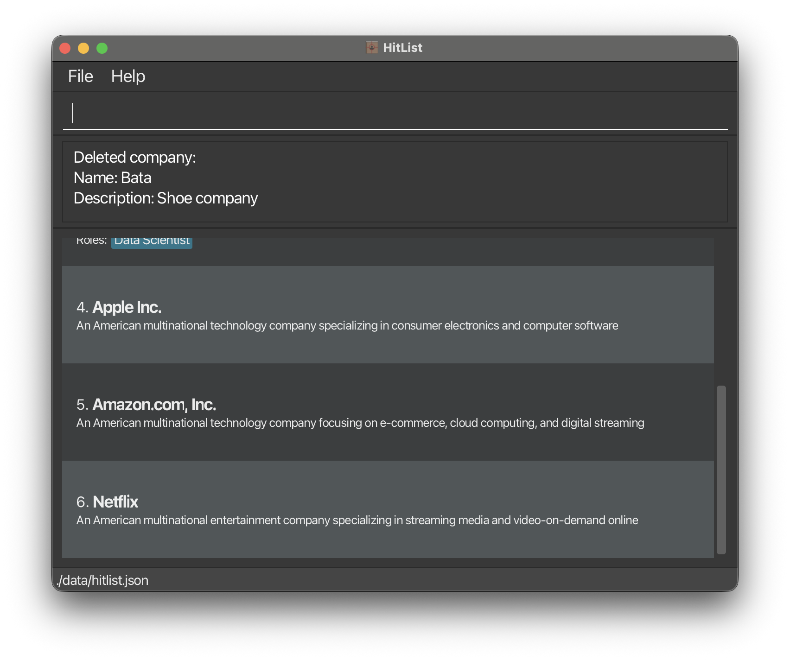
  

 

### Listing all companies : `cmplist`

Shows a list of all companies and the description in the HitList. Optionally, if a company name is specified, shows the roles of the company.

Format: `cmplist [/c COMPANY_NAME]`
* If the company name is specified, shows the roles of the company.
* If the company name is not specified, shows a list of all companies with its description in HitList.

Example:
* `cmplist`

  

    
  

 

* `cmplist /c Google Inc.`

  

    
  

 

### Locating companies : `cmpfind`

Finds companies whose names match any given substring.

Format: `cmpfind KEYWORD...`

* Company name search is case-insensitive.
  e.g. `google` matches `Google`
* Company name search uses substring matching.
  e.g. `fli` matches `Netflix`
* If multiple company name keywords are given, a Company matching any one of them is returned.

Examples:
* `cmpfind inc`

  

    
  

 

* `cmpfind google flix`

  

    
  

 

### Adding a role to a company : `roleadd`

Adds a role to a specified existing company in the HitList.

Format: `roleadd /r ROLE_NAME /d ROLE_DESCRIPTION /c COMPANY_NAME`

* The role name must be unique within the company and not the same as any existing role in that company.
* The role name can be any string which does not include `/` or have invisible characters󠀨.
* The role description can be any string which does not include `/` or have invisible characters󠀨.
* The company name must be an existing company in HitList.
* The company name search is **case-insensitive** (e.g., `google` matches `Google`/`GoOgLe`/`GOOGLE`).
* The search matches the **exact company name** as stored in HitList. For example, `cmpfind google` will match a company named exactly `Google`, but will **not** match `Google Inc.` or `google.com` since those are different company names.
* The company will be displayed with its original registered name (e.g., `Google`) after the operation.

Limitations:
* Role name is restricted to a maximum of 50 characters.
* Role description is restricted to a maximum of 100 characters.
* No full support for languages other than English.

Examples:
* `cmplist /c Google Inc.` followed by `roleadd /r Quality Assurance Engineer /d Ensures software products meet quality standards by developing test plans /c Google Inc.`

  

    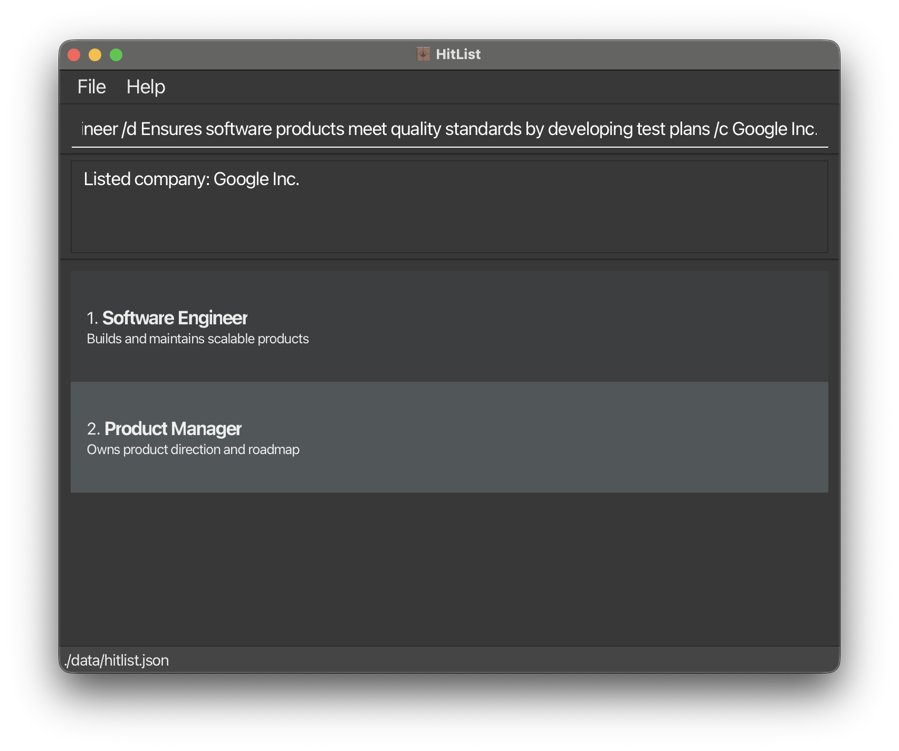
  

  

    
  

 

### Deleting a role from a company : `roledel`

Deletes a role from a specified existing company in the HitList.

<box theme="danger" header="**CAUTION: Irreversible Action**">
    This command deletes the specified role from the company in HitList. Use with caution.
    The action is <b>irreversible</b> and there is <b>no confirmation prompt</b> before the action is executed.
</box>

Format: `roledel /r ROLE_NAME /c COMPANY_NAME` or `roledel INDEX /c COMPANY_NAME`

* Deletes a role from the company by either specifying the role name or the role's index number.
* The role name must be an existing role within the company.
* The index refers to the position of the role in the company's role list (1-based indexing).
* The company name must be an existing company in HitList.
* The company name search is **case-insensitive** (e.g., `google` matches `Google`/`GoOgLe`/`GOOGLE`).
* The search matches the **exact company name** as stored in HitList. For example, `cmpfind google` will match a company named exactly `Google`, but will **not** match `Google Inc.` or `google.com` since those are different company names.
* The company will be displayed with its original registered name (e.g., `Google`) after the operation.

Examples:
* `cmplist /c Google Inc.` followed by `roledel /r Quality Assurance Engineer /c Google Inc.`

  

    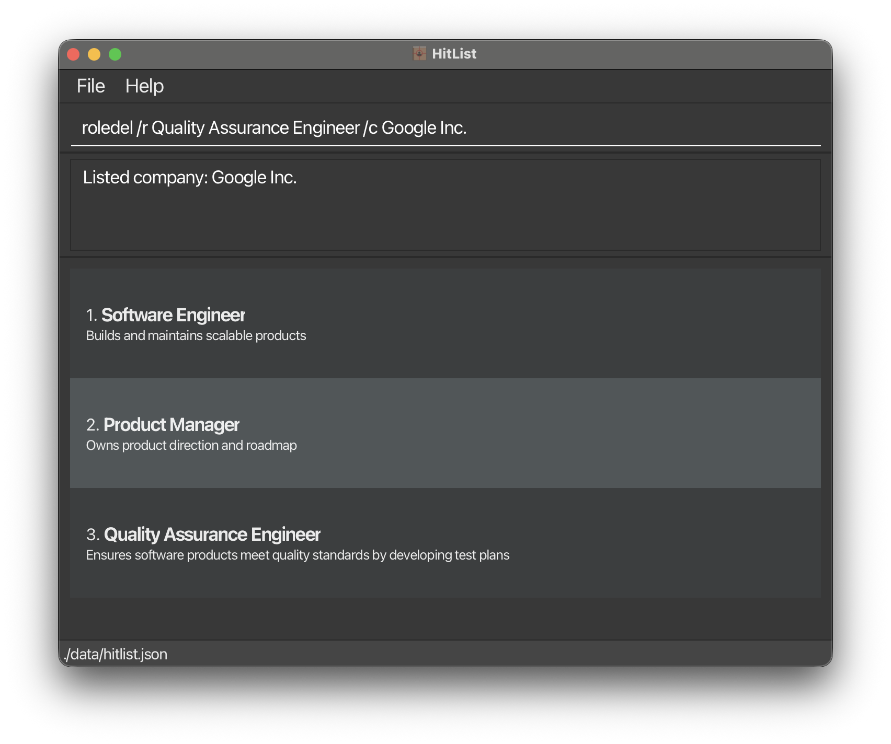
  

  

    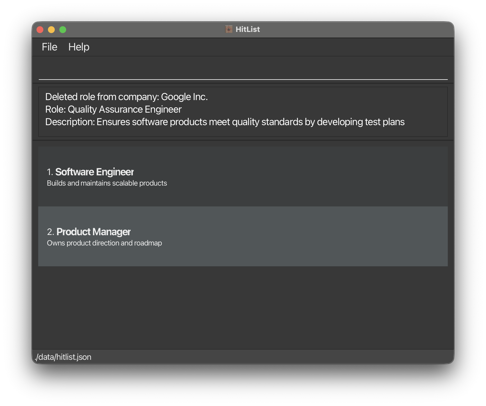
  

 

* `cmplist /c Meta Platforms, Inc.` followed by `roledel 1 /c Meta Platforms, Inc.`

  

    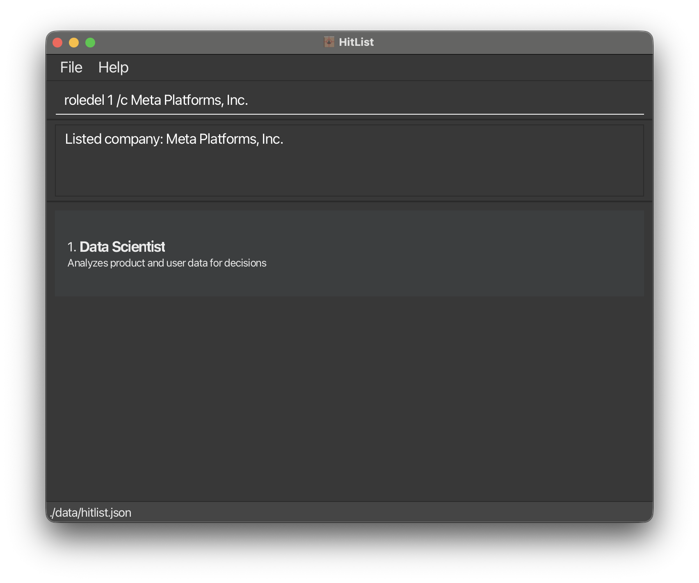
  

  

    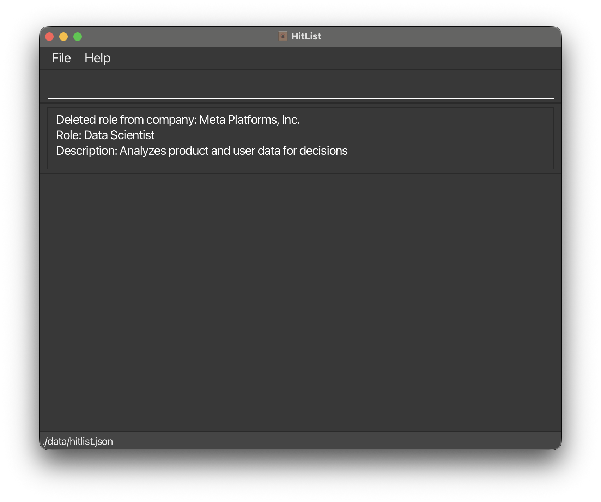
  

 

### Clearing all entries : `clear`

Clears all entries from the HitList.

<box theme="danger" header="**CAUTION: Complete Data Wipe**">
    This command deletes <b>all contacts, contact groups, companies, and roles</b> from HitList. Use with extreme caution.
    The action is <b>irreversible</b> and there is <b>no confirmation prompt</b> before the action is executed.
</box>

Format: `clear`

### Exiting the program : `exit`

Exits the program.

Format: `exit`

### Saving the data

HitList data are saved in the hard disk automatically after any command that changes the data. There is no need to save manually.

### Editing the data file

HitList data are saved automatically as a JSON file `[JAR file location]/data/hitlist.json`.

Advanced users are welcome to update data directly by editing that data file.

<box theme="danger" header="**CAUTION: Manual Modification**">
    If your changes to the data file make its format invalid, HitList will discard all data and start with an empty data file at the next run. 
    Hence, it is recommended to take a backup of the file before editing it.
</box>

Furthermore, certain edits can cause HitList to behave in unexpected ways, for example, if a value entered is outside the acceptable range. Therefore, edit the data file only if you are confident that you can update it correctly.

### Archiving data files `[coming in v2.0]`

_Details coming soon ..._

--------------------------------------------------------------------------------------------------------------------

## Glossary

1. `CLI (Command Line Interface)`: A text based interface where you interact with the application by typing commands.

1. `GUI (Graphical User Interface)`: A visual interface allowing users to interact with the software through graphical icons and visual indicators.

1. `JAR (Java ARchive)`: The file format used to distribute the HitList application.

1. `JDK (Java Development Kit)`: The software development environment required to run the Java application.

1. `JSON (JavaScript Object Notation)`: The lightweight data format used by HitList to save your contacts and preferences automatically.

1. `Parameter`: Specific data provided alongside a command to tell the application exactly what to do (for example, supplying a name or phone number).

1. `Index`: The positive integer corresponding to an item in the currently displayed list, used to target specific records for editing or deletion.

1. `Substring Matching`: A search behavior where typing a sequence of letters matches any word that contains those letters anywhere inside it (beginning, middle, or end).

--------------------------------------------------------------------------------------------------------------------

## FAQ

<box header="Who is the intended user for HitList?" type="info" light>
    HitList is optimized for headhunters managing extensive lists of contacts, roles, and companies, but it remains fully usable by anyone needing efficient contact management.
</box>

<box header="How do I save my progress?" type="info" light>
    There is no need to save manually. HitList automatically saves all changes to a JSON file on your hard drive immediately after any command alters the data.
</box>

<box header="Can I undo a deletion?" type="info" light>
    No. Commands that remove data, such as deleting contacts, groups, companies, or clearing the entire list, are irreversible and execute immediately without a confirmation prompt. Exercise caution.
</box>

<box header="How do I transfer my data to another computer?" type="info" light>
    Install the app on the other computer and overwrite the empty data file it creates with the file that contains the data of your previous HitList home folder.
</box>

<box header="Can I edit the data file directly?" type="info" light>
    Yes, advanced users can directly edit the hitlist.json file. You can refer to the <a href="#editing-the-data-file">following section</a>.
</box>

--------------------------------------------------------------------------------------------------------------------

## Command summary

| Action                          | Format                                                                               | Examples                                                                              |
|---------------------------------|--------------------------------------------------------------------------------------|---------------------------------------------------------------------------------------|
| **Getting help**                | `help`                                                                               | `help`                                                                                |
| **Add contact**                 | `add /n NAME /p PHONE_NUMBER [/e EMAIL] [/a ADDRESS]`                                | `add /n Betsy Crowe /p 87654321 /e betsy.crowe@gmail.com /a 321, Clementi Rd, 123465` |
| **Delete contact**              | `del INDEX` or `del /n NAME` or `delete INDEX` or `delete /n NAME` | `del 3` or `del /n David Li` or `delete 3` or `delete /n David Li`  |
| **Edit contact**                | `edit INDEX [/n NAME] [/p PHONE_NUMBER] [/e EMAIL] [/a ADDRESS]`                     | `edit 2 /n James Lee /e jameslee@example.com`                                         |
| **List contacts**               | `list`                                                                               | `list`                                                                                |
| **Find contact(s)**             | `find KEYWORD...`                                                                    | `find John`                                                                           |
| **Add contact group**           | `grpadd /g GROUP_NAME`                                                               | `grpadd /g Students`                                                                  |
| **Delete contact group**        | `grpdel /g GROUP_NAME`                                                               | `grpdel /g Students`                                                                  |
| **List contact groups**         | `grplist`                                                                            | `grplist`                                                                             |
| **List contacts in group**      | `grplist /g GROUP_NAME`                                                              | `grplist /g Students`                                                                 |
| **Assign contact to group**     | `grpassign /n NAME /g GROUP_NAME`                                                    | `grpassign /n Alex Yeoh /g Students`                                                  |
| **Unassign contact from group** | `grpunassign /n NAME /g GROUP_NAME`                                                  | `grpunassign /n Alex Yeoh /g Students`                                                |
| **Add company**                 | `cmpadd /c COMPANY_NAME /d COMPANY_DESCRIPTION`                                      | `cmpadd /c Google /d Tech giant`                                                      |
| **Delete company**              | `cmpdel /c COMPANY_NAME`                                                             | `cmpdel /c Google`                                                                    |
| **List companies**              | `cmplist`                                                                            | `cmplist`                                                                             |
| **Find company**                | `cmpfind KEYWORD...`                                                                 | `cmpfind inc`                                                                         |
| **Add role to company**         | `roleadd /r ROLE_NAME /d ROLE_DESCRIPTION /c COMPANY_NAME`                           | `roleadd /r Software Tester /d Tests provided software /c Google Inc.`                |
| **Delete role from company**    | `roledel /r ROLE_NAME /c COMPANY_NAME` or `roledel INDEX /c COMPANY_NAME`      | `roledel /r Software Engineer /c Google Inc.` or `roledel 1 /c Google Inc.`     |
| **Clear**                       | `clear`                                                                              | `clear`                                                                               |
| **Exit**                        | `exit`                                                                               | `exit`                                                                                |
