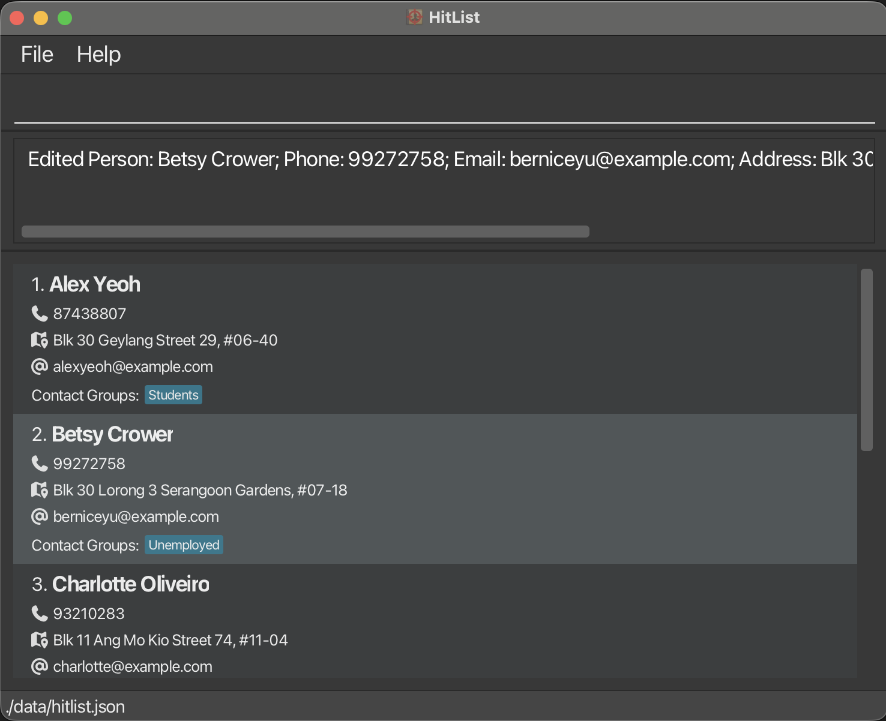
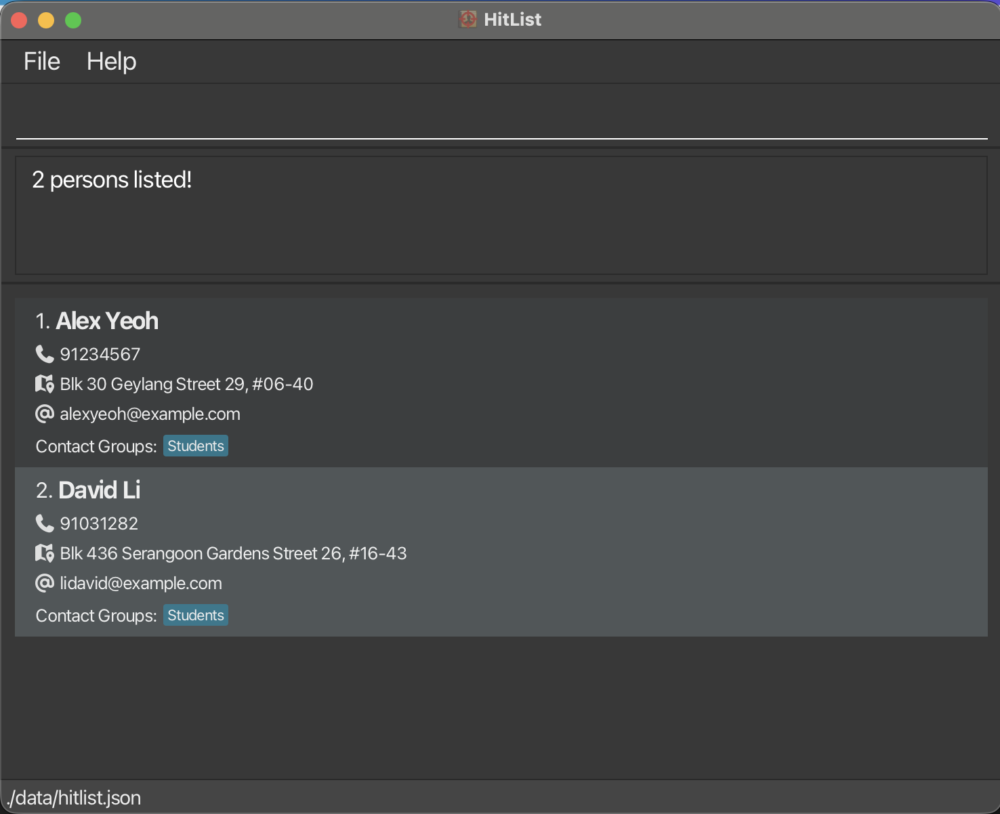

# HitList User Guide

HitList is a **desktop app for managing contacts, optimized for use via a Command Line Interface** (CLI) while still having the benefits of a Graphical User Interface (GUI). If you can type fast, HitList can get your contact management tasks done faster than traditional GUI apps.

HitList is targeted at headhunters who need to manage a large number of contacts and companies, but it can be used by anyone who needs to manage their contacts efficiently.

--------------------------------------------------------------------------------------------------------------------

## Quick start

1. Ensure you have Java `17` or above installed in your Computer.
2. **Mac users:** Ensure you have the precise JDK version prescribed [here](https://se-education.org/guides/tutorials/javaInstallationMac.html).
3. Download the latest `.jar` file from [here](https://github.com/AY2526S2-CS2103T-W11-2/tp/releases).
4. Copy the file to the folder you want to use as the _home folder_ for your HitList.
5. Open a command terminal, `cd` into the folder you put the jar file in, and use the `java -jar hitlist.jar` command to run the application.
6. A GUI similar to the below should appear in a few seconds. Note how the app contains some sample data.

7. Type the command in the command box and press Enter to execute it.
   e.g. typing **`help`** and pressing Enter will open the help window.
8. Some example commands you can try:
   * `add /n John Doe /p 98765432` : Adds a contact named `John Doe` to the HitList.
   * `list` : Lists all contacts.
   * `delete 3` : Deletes the 3rd contact shown in the current list.
   * `clear` : Deletes all contacts.
   * `exit` : Exits the app.
9. Refer to the [Features](#features) below for details of each command.

--------------------------------------------------------------------------------------------------------------------

## Features

**Notes about the command format:**

* Words in `UPPER_CASE` are the parameters to be supplied by the user.
  e.g. in `add /n NAME`, `NAME` is a parameter which can be used as `add /n John Doe`
* Items in square brackets are optional.
  e.g. `edit INDEX [/n NAME] [/p PHONE]` can be used as `edit 3 /n John Doe` or as `edit 3 /p 98765432`
* Parameters can be in any order.
  e.g. if the command specifies `/n NAME /p PHONE_NUMBER`, `/p PHONE_NUMBER /n NAME` is also acceptable
* Extraneous parameters for commands that do not take in parameters, such as `help`, `list`, `exit`, and `clear`, will be ignored.
  e.g. if the command specifies `help 123`, it will be interpreted as `help`
* If you are using a PDF version of this document, be careful when copying and pasting commands that span multiple lines as space characters surrounding line-breaks may be omitted when copied over to the application.

### Viewing help : `help`

Shows a message explaining how to access the help page.

Format: `help`

### Adding a contact : `add`

Adds a contact to the HitList.

Format: `add /n NAME /p PHONE_NUMBER [/e EMAIL] [/a ADDRESS]`

* The `NAME` and `PHONE_NUMBER` parameters are mandatory.
* All other parameters are optional.

Examples:
* `add /n John Doe /p 98765432`

* `add /n Betsy Crowe /p 87654321 /e betsy.crowe@gmail.com /a 321, Clementi Rd, 123465`

### Editing a contact : `edit`

Edits an existing contact in the HitList.

Format: `edit INDEX [/n NAME] [/p PHONE] [/e EMAIL] [/a ADDRESS]`

* Edits the contact at the specified `INDEX`.
* The index refers to the index number shown in the displayed HitList.
* The index **must be a positive integer** `1, 2, 3, …`
* At least one of the optional fields must be provided.
* Existing values will be updated to the input values.

Examples:

* `edit 1 /p 91234567` edits the phone number of the first contact to `91234567`

* `edit 2 /n Betsy Crower` edits the name of the second contact to `Betsy Crower`

### Deleting a contact : `delete`

Deletes the specified contact from HitList.

Format: `delete INDEX`

* Deletes the contact at the specified `INDEX`.
* The index refers to the index number shown in the displayed HitList.
* The index **must be a positive integer** `1, 2, 3, …`

Examples:
* `list` followed by `delete 2` deletes the second contact in HitList

* `find Irfan` followed by `delete 1` deletes the first contact in the results of the `find` command

Format `delete /n CONTACT_NAME`

* Deletes the contact with the specified name from HitList.
* The contact name must exactly match an existing contact in HitList.

Example: 
* `list` followed by `delete /n David Li` deletes the contact named `David Li` from HitList

### Listing all contacts : `list`

Shows a list of all contacts in the HitList.

Format: `list`

### Locating contacts : `find`

Finds contacts whose names match any given prefix.

Format: `find [KEYWORD]...`

* Name search is case-insensitive.
  e.g. `han` matches `Hans`
* Name search uses prefix matching.
  e.g. `Han` matches `Hans`
* If multiple name keywords are given, a contact matching any one of them is returned.

Examples:
* `find John` returns `john` and `John Doe`

* `find alex david` returns `Alex Yeoh`, `David Li`

### Adding a contact group : `grpadd`

Adds a contact group to the HitList.

Format: `grpadd /g GROUP_NAME`

Examples:
* `grpadd /g Admins`

* `grpadd /g Experienced`

### Deleting a contact group : `grpdel`

Deletes the specified contact group from HitList.

Format: `grpdel /g GROUP_NAME`

Examples:
* `grpdel /g Admins`

* `grpdel /g Unemployed`

> !NOTE
> Deleting a contact group does not delete the contacts in that group from HitList. It only deletes the group itself and the association of the contacts to that group.
> e.g. if `John Doe` is in the `Students` group, and the `Students` group is deleted, `John Doe` will still be in HitList but will no longer be associated with any contact group.
>
> Group Names are currently case-sensitive, so `Students` and `students` are considered different groups. Hence, deleting `students` will not delete the `Students` group.

### Listing contacts in a contact group : `grplist`

Lists all the contacts who are members of a specified contact group.

Format: `grplist /g GROUP_NAME`

Examples:
* `grplist /g Students`

* `grplist /g Experienced`

### Assigning a contact to a contact group : `grpassign`

Adds an existing contact to an existing contact group.

Format: `grpassign /n NAME /g GROUP_NAME`

* The contact name must exactly match an existing contact in HitList.
* The group name must exactly match an existing contact group in HitList.

Examples:
* `grpassign /n Alex Yeoh /g Experienced`

* `grpassign /n Betsy Crowe /g Students`

### Adding a company : `cmpadd`

Adds a company to the HitList.

Format: `cmpadd /c COMPANY_NAME /d COMPANY_DESCRIPTION`

* The company name must be unique and not the same as any existing company in HitList.
* The company description can be any string which does not include `/` or start with spaces.

Examples:
* `cmpadd /c Google /d Tech giant`

* `cmpadd /c Meta /d Social media giant`

### Deleting a company : `cmpdel`

Deletes the specified company from HitList.

Format: `cmpdel /c COMPANY_NAME`

* The company name must be an existing company in HitList.
* The company name typed must be the exact company name registered in HitList.

Example:
* `cmpdel /c Google` deletes a company named `Google` from hitList.

* `cmpdel /c Meta` deletes a company named `Meta` from hitList.

### Listing all Companies : `cmplist`

Shows a list of all companies in the hitList.

Format: `cmplist`

### Adding a role to a company : `roleadd`

Adds a role to a specified existing company in the HitList.

Format: `roleadd /r ROLE_NAME /d ROLE_DESCRIPTION /c COMPANY_NAME`

* The role name must be unique within the company and not the same as any existing role in that company.
* The role description can be any string which does not include `/` or start with spaces.
* The company name must be an existing company in HitList.
* The company name typed must be the exact company name registered in HitList.

Examples:
* `roleadd /r Quality Assurance Engineer /d Ensures software products meet quality standards by developing test plans /c Google Inc.` adds a role named `Quality Assurance Engineer` to the company `Google`.

* `roleadd /r DevOps Engineers /d Manages infrastructure and automates deployment processes, bridging the gap between development and IT operations /c Meta Platforms, Inc.` adds a role named `DevOps Engineers` to the company `Meta`.

### Clearing all entries : `clear`

Clears all entries from the HitList.

Format: `clear`

> [!CAUTION]
> This command deletes all contacts, contact groups, companies, and roles from the HitList. Use with caution.
> The action is irreversible and there is no confirmation prompt before the action is executed.

### Exiting the program : `exit`

Exits the program.

Format: `exit`

### Saving the data

HitList data are saved in the hard disk automatically after any command that changes the data. There is no need to save manually.

### Editing the data file

HitList data are saved automatically as a JSON file `[JAR file location]/data/hitlist.json`.

Advanced users are welcome to update data directly by editing that data file.

**Caution:** If your changes to the data file make its format invalid, HitList will discard all data and start with an empty data file at the next run. Hence, it is recommended to take a backup of the file before editing it.

Furthermore, certain edits can cause HitList to behave in unexpected ways, for example, if a value entered is outside the acceptable range. Therefore, edit the data file only if you are confident that you can update it correctly.

### Archiving data files `[coming in v2.0]`

_Details coming soon ..._

--------------------------------------------------------------------------------------------------------------------

## FAQ

**Q**: How do I transfer my data to another Computer?

**A**: Install the app in the other computer and overwrite the empty data file it creates with the file that contains the data of your previous HitList home folder.

--------------------------------------------------------------------------------------------------------------------

## Known issues

1. **When using multiple screens**, if you move the application to a secondary screen, and later switch to using only the primary screen, the GUI will open off-screen. The remedy is to delete the `preferences.json` file created by the application before running the application again.

--------------------------------------------------------------------------------------------------------------------

## Command summary

| Action                      | Format                                                           | Examples                                                                              |
|-----------------------------|------------------------------------------------------------------|---------------------------------------------------------------------------------------|
| **Getting Help**            | `help`                                                           | `help`                                                                                |
| **Add contact**             | `add /n NAME /p PHONE_NUMBER [/e EMAIL] [/a ADDRESS]`            | `add /n Betsy Crowe /p 87654321 /e betsy.crowe@gmail.com /a 321, Clementi Rd, 123465` |
| **Delete contact**          | `delete INDEX`\n`delete /n NAME`                                 | `delete 3`\n`delete /n David Li`                                                      |
| **Edit contact**            | `edit INDEX [/n NAME] [/p PHONE_NUMBER] [/e EMAIL] [/a ADDRESS]` | `edit 2 /n James Lee /e jameslee@example.com`                                         |
| **List contacts**           | `list`                                                           | `list`                                                                                |
| **Find contact(s)**         | `find [KEYWORD]...`                                              | `find John`                                                                           |
| **Add contact group**       | `grpadd /g GROUP_NAME`                                           | `grpadd /g Students`                                                                  |
| **Delete contact group**    | `grpdel /g GROUP_NAME`                                           | `grpdel /g Students`                                                                  |
| **List contact groups**     | `grplist`                                                        | `grplist`                                                                             |
| **List contacts in group**  | `grplist /g GROUP_NAME`                                          | `grplist /g Students`                                                                 |
| **Assign contact to group** | `grpassign /n NAME /g GROUP_NAME`                                | `grpassign /n Alex Yeoh /g Students`                                                  |
| **Add Company**             | `cmpadd /c COMPANY_NAME /d COMPANY_DESCRIPTION`                  | `cmpadd /c Google /d Tech giant`                                                      |
| **Delete Company**          | `cmpdel /c COMPANY_NAME`                                         | `cmpdel /c Google`                                                                    |
| **List Companies**          | `cmplist`                                                        | `cmplist`                                                                             |
| **Add Role to Company       | `roleadd /r ROLE_NAME /d ROLE_DESCRIPTION /c COMPANY_NAME`       | `roleadd /r Software Tester /d Tests provided software /c Google Inc.`                |
| **Clear**                   | `clear`                                                          | `clear`                                                                               |
| **Exit**                    | `exit`                                                           | `exit`                                                                                |
